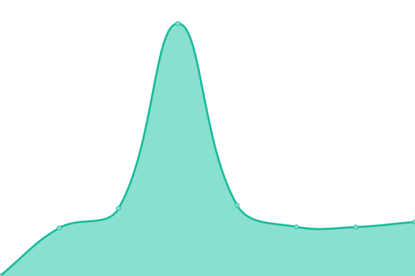

# [📈 Live Status](https://ShiroSekai.github.io/upptime): <!--live status--> **🟧 部分停机**

This repository contains the open-source uptime monitor and status page for [白](justmyblog.net), powered by [Upptime](https://github.com/upptime/upptime).

With [Upptime](https://upptime.js.org), you can get your own unlimited and free uptime monitor and status page, powered entirely by a GitHub repository. We use [Issues](https://github.com/ShiroSekai/upptime/issues) as incident reports, [Actions](https://github.com/ShiroSekai/upptime/actions) as uptime monitors, and [Pages](https://ShiroSekai.github.io/upptime) for the status page.

<!--start: status pages-->
<!-- This summary is generated by Upptime (https://github.com/upptime/upptime) -->
<!-- Do not edit this manually, your changes will be overwritten -->
<!-- prettier-ignore -->
| 链接 | 状态 | 历史 | 响应时间 | 正常运行时间 |
| --- | ------ | ------- | ------------- | ------ |
|  [JustMyBlog](https://justmyblog.net) | 🟩 正常运行 | [just-my-blog.yml](https://github.com/ShiroSekai/upptime/commits/HEAD/history/just-my-blog.yml) | 

 1412毫秒
     
 | 

<a href="https://status.22-33.top/history/just-my-blog">85.82%</a>
    

|  [Share](https://share.moeblog.vip) | 🟥 停机 | [share.yml](https://github.com/ShiroSekai/upptime/commits/HEAD/history/share.yml) | 

 1723毫秒
     
 | 

<a href="https://status.22-33.top/history/share">31.82%</a>
    

|  [IMG](https://img.moeblog.vip) | 🟩 正常运行 | [img.yml](https://github.com/ShiroSekai/upptime/commits/HEAD/history/img.yml) | 

 2336毫秒
     
 | 

<a href="https://status.22-33.top/history/img">100.00%</a>
    

|  [API](https://api.moeblog.vip) | 🟩 正常运行 | [api.yml](https://github.com/ShiroSekai/upptime/commits/HEAD/history/api.yml) | 

 1601毫秒
     
 | 

<a href="https://status.22-33.top/history/api">100.00%</a>
    

|  [CDN](https://cdn.moeblog.vip) | 🟩 正常运行 | [cdn.yml](https://github.com/ShiroSekai/upptime/commits/HEAD/history/cdn.yml) | 

 1364毫秒
     
 | 

<a href="https://status.22-33.top/history/cdn">100.00%</a>
    

|  托管 ① | 🟩 正常运行 | [.yml](https://github.com/ShiroSekai/upptime/commits/HEAD/history/.yml) | 

 1264毫秒
     
 | 

<a href="https://status.22-33.top/history/">17.64%</a>
    

<!--end: status pages-->

[**Visit our status website →**](https://ShiroSekai.github.io/upptime)

## 📄 License

- Powered by: [Upptime](https://github.com/upptime/upptime)
- Code: [MIT](./LICENSE) © [白](justmyblog.net)
- Data in the `./history` directory: [Open Database License](https://opendatacommons.org/licenses/odbl/1-0/)
